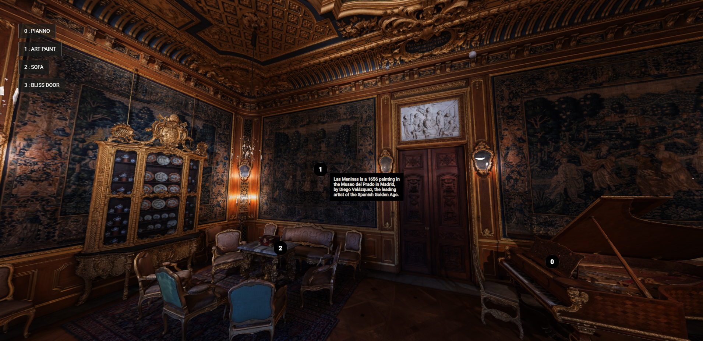

# building annotation with three.js and tween.js

### Progress:

Astronaut 3D GLTF model rendered which need to be annotated: 

### How to replicate this to your Model:

1. I have got all these annotation position manually and that means that in animate function you can see there is a condition which check if it is in developer mode
   which does raycasting. If you set that variable true and go anywhere you want and click on the target in the view you wanted, it will console you camera position and      target position for that annotaion.
   
2. Append this with description if needed in the annotation file in project

### Why not use child element of mesh instead of doing this manually?

The model that you can see in the pic above is not model generated from Modelling Software like Blender or Maya rather generated from Scanning ( i didn't scan it). So in Model generated from scanning, scene child are not as managed and as structured as model from Modelling Software.

If you want to explore more,

checkout <b>[FPC repo](https://github.com/pravinpoudel/building-annotation/tree/FPC)</b> where i am struggling so much to get simple things done because this is Scanned Model.

Update:

Added an animated 3D model which dance on playing music

